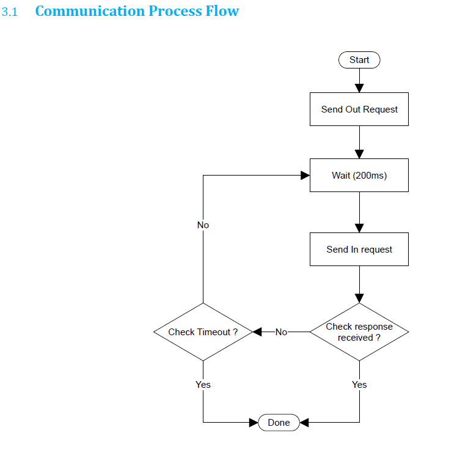

                                        **Notes for MELO30**

like MELO30 (FAP30) is hardware model name 
VID = vendor id 
PID = product id 
SDk = software development kit
MFG = Manufacturing (MFG) Data: Information related to the product's creation, such as the manufacturing date, batch number, serial number,

btn [Full Target Capure] - takes live finger print, click on stop capture to stop
There are two init , init Target and init Finger 

[Full target capture]    
[Final target Capture]   
[Finger Caputure]        

    -- These all three button are capturing live and stops after [stop capture] and shows captured image 

[Finger Capture with Quality] -- more we put pressure quality increases,  if its less then 60 then it doesnt capture and says time out

if (objCMDInfo.ResData[0] == objCMDInfo.CMD && objCMDInfo.ResData[1] == 0 && objCMDInfo.ResData[2] == 0 && objCMDInfo.ResData[3] == 0) {
    isTargetInit = true;
    obj.isTargetInit = true;
    ErrorMsg = "Device Initialize with High FPS.";
    return 0;
}

    --  This condition decides for wether the device is connected or not , it checks indices of the byte array 
        .ResData[] at indices  0 1 2 3 

how biometric fingerprint data is structured and transferred (as a response from the device to the host, over USB).

FIR = Finger Image Record 
---This is the raw or compressed image of the fingerprint captured by the sensor. It contains the pixel data of the finger — like a photo.

FMR = Finger Minutuae Record 
---This is the processed fingerprint template, containing extracted minutiae features (like ridge endings and bifurcations), not the image itself. It’s used for matching/verification, not viewing.

NFIQ = NIST Finger Image Quality 